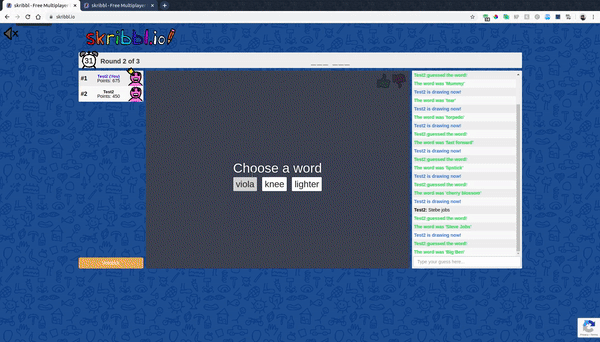

# Skribble.io-Image-Reference

## Description
Skribble.io-Image-Reference is a chrome extension that allows you to reference an image 
while drawing an image in Skribbl.io. Simply clicking the icon in the chrome extensions bar will display an image corresponding to the word the user is currently drawing. The user can press next to display a different reference image. **Currently, this will not work unless you provide an unsplash api key in line 37 of popup.js**  

## How to use
1. Provide and api key on line 37 of popup.js
2. Clone this repo and unzip it
3. Type "chrome://extensions/" into the chrome search bar
4. Enable developer mode on top right of page
5. On top left of screen, click on "Load unpacked"
6. Select the folder of this git repo

## To Do List
- Find a different way to grab image. Current method displays copyright free images which sometimes results in bad reference images
- Implement storage feature so when the user clicks off to draw, clicking the extension again will display the same image the user was looking at before the extension was closed
- Implement nicer looking UI
